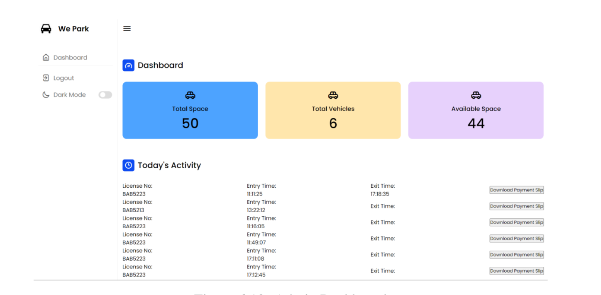

# wePark-FE 
It is  a simple admin website for access of timestamp of vehicle entry and exit from LPR system. The time can be used to then print the payslip for payment based on the timing of parking. 

It is implemented in vanilla html,css and javascript which is then served using node. 

LPR system : https://github.com/sairojp/wePark-LPR

Backend app : https://github.com/sairojp/wePark-BE
